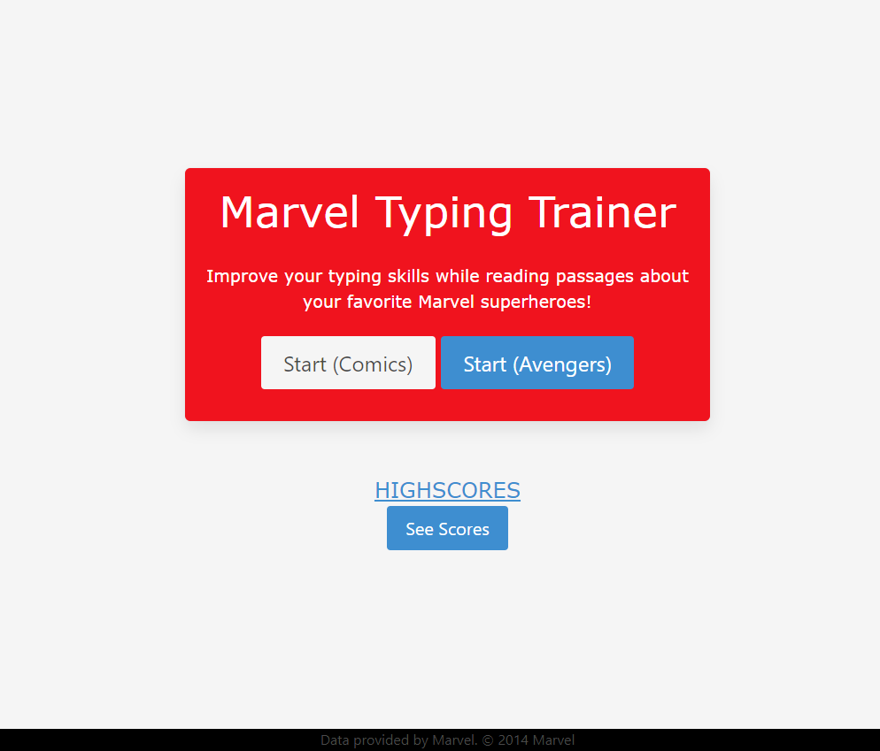

# Marvel-Typing-Trainer

## Description

This typing trainer generates the user a paragraph of text that the user can interact with. The user should type the text as quickly and accurately as possible. As the user types, their accuracy, and words per minute will be calculated. This will give the user a benchmark on where they stand in typing skill, allowing them to continiously train.

## User Story

AS a programmer who wishes to improve their typing speed  

I WANT to benchmark my typing skills 

SO THAT I can improve my accuracy and words per minute

## Usage

To start, choose whether you want to type passages based on the Marvel comics, or the Avengers movies. You should be redirected to a page with just a textbox.
Start typing the passage, character by character, and each character will highlight either green for correct, or red for incorrect. If you make a mistake, you can use the backspace key.
Once completed, enter your name into the input box, and the entry should now display on the highscores page.

## Image of Deployed Application

;

## Link to Application

https://cmeesh11.github.io/Marvel-Typing-Trainer/

## Credit

omdbapi: https://www.omdbapi.com/  

Marvel Comics API: https://developer.marvel.com/  

Marvel font: https://www.fontspace.com/marvel-font-f32182

